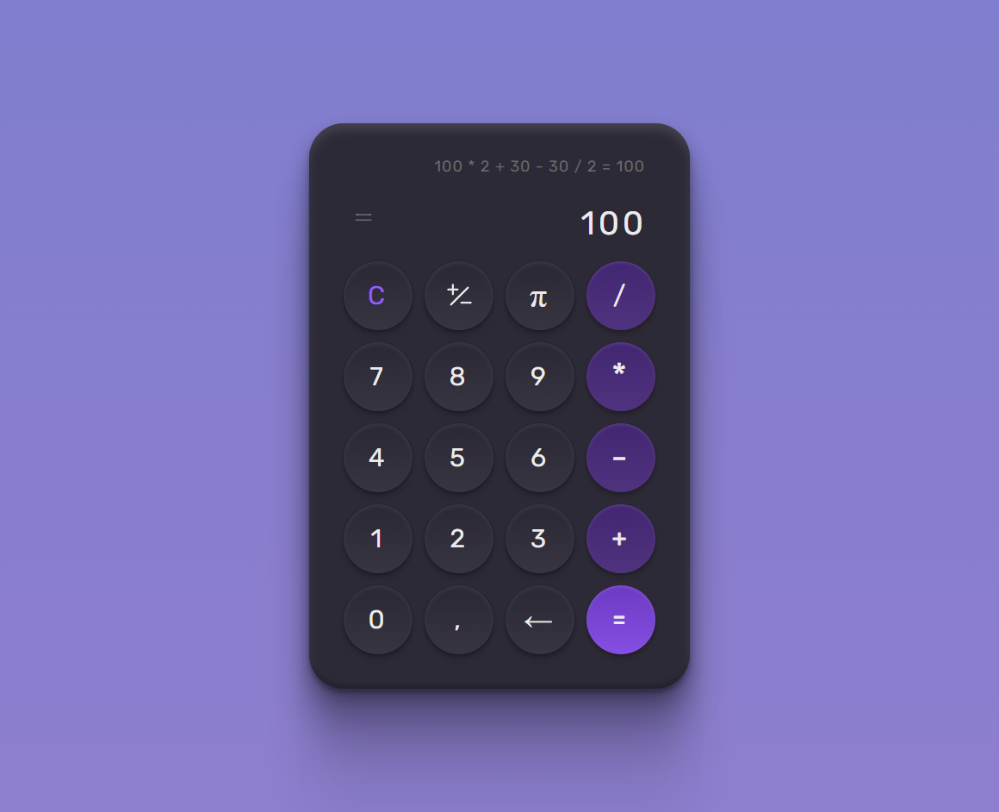

<h1 align='center'>Calculator</h1>

A calculator challenge of Rocketseat. In this app I am using HTML, CSS and JavaScript.

## Features Developed

- [x] Animation when clicking buttons
- [x] Responsivity
- [x] Perform mathematical operations
- [x] Use the keyboard to perform operations
- [x] Use 'p' or 'P' to call Pi key
- [x] Use 'c' or 'C' to clear the display and the operations on memory
- [x] Use the Backspace key to clear each character

## Screenshots

The interface

 

## Prototype

You can access the Rocketseat prototype by clicking the button below.

## Technologies

## Services Used

</a>

## Deploy

You can access the project by clicking the button below.

